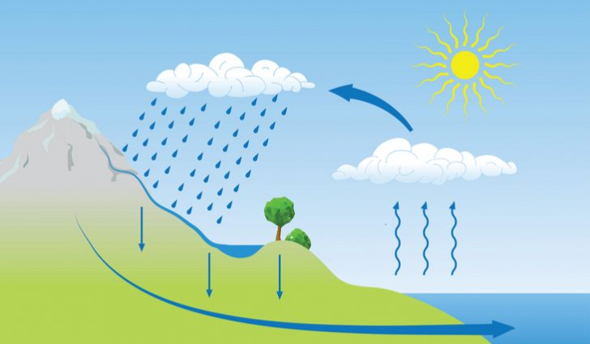
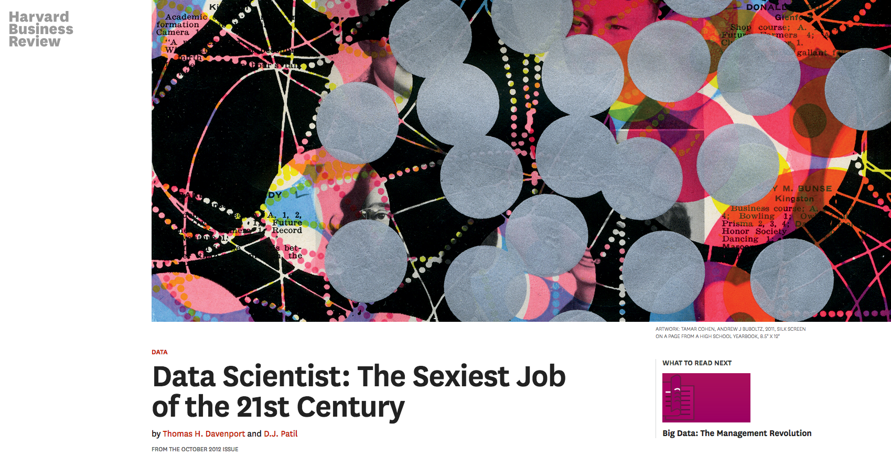
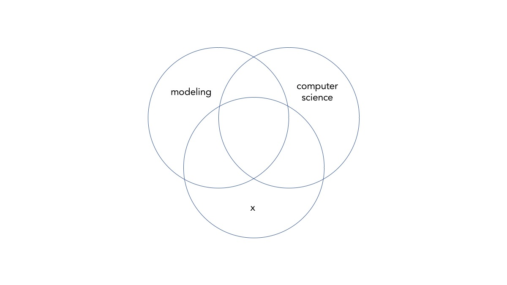
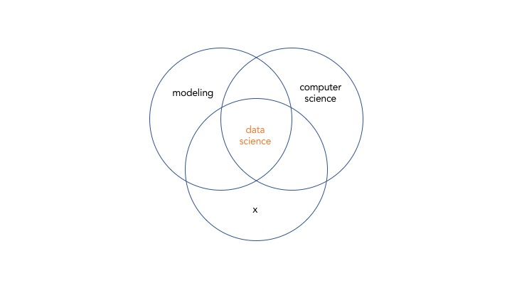
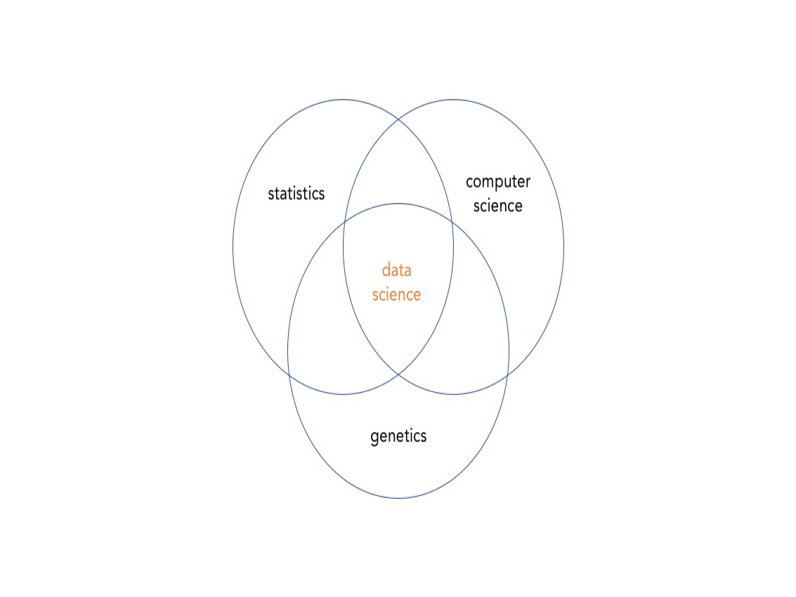
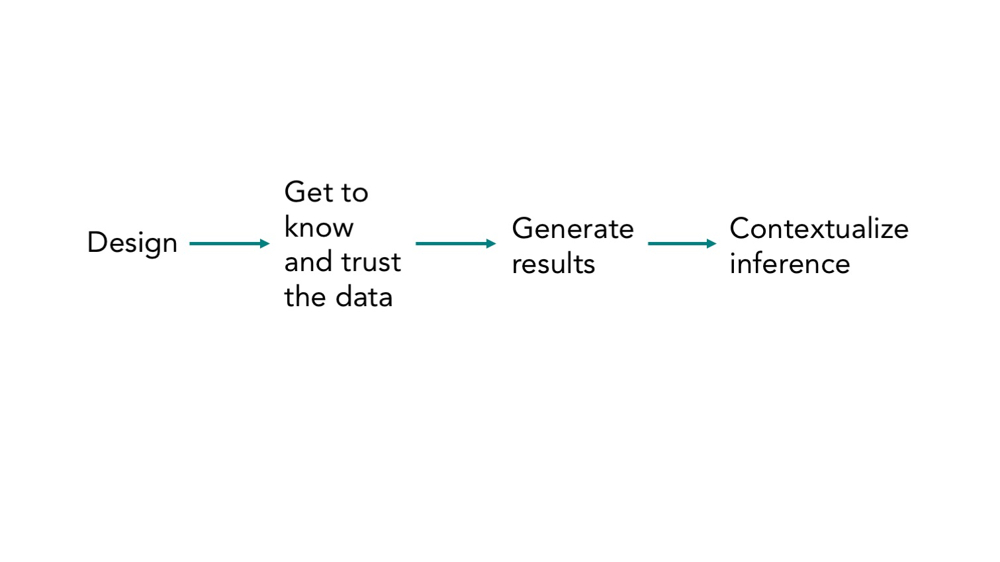
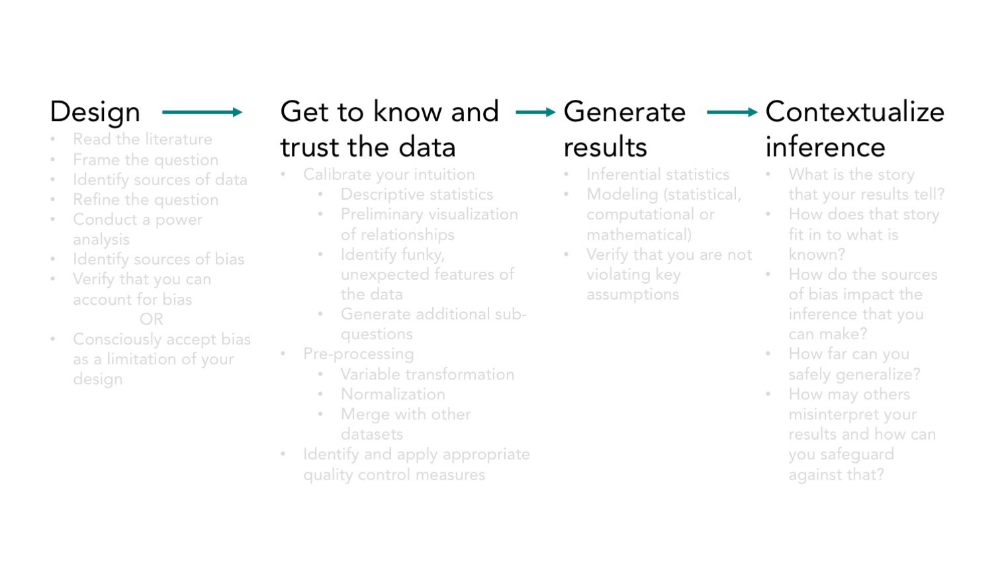
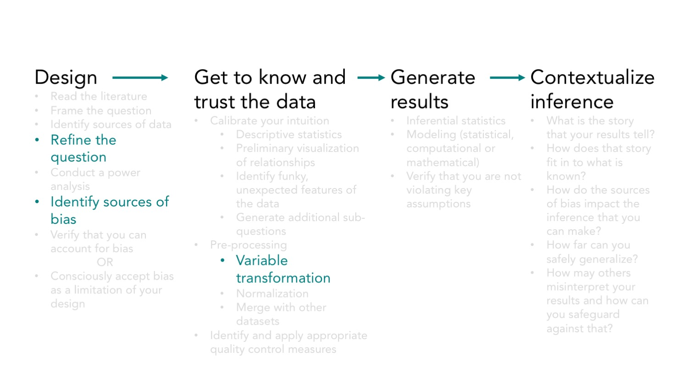
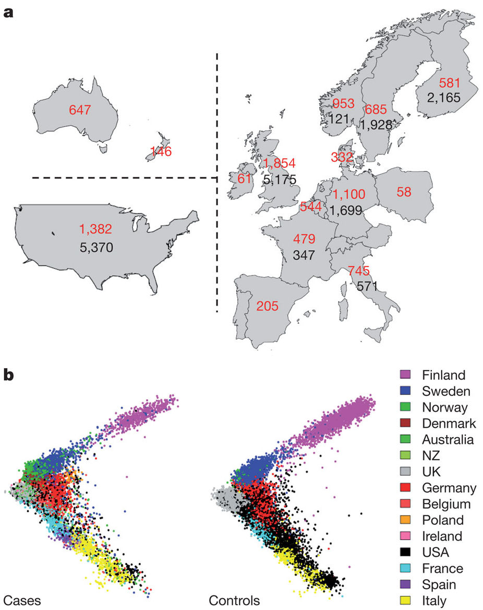

 Mirror, mirror, on the wall,  is my study valid at all?  

 
Athena Hadjixenofontos, PhD
 
Director of Engagement
Center for Computational Science
ahadjixenofontos@miami.edu
 

Note:
Hello, my name is Athena Hadjixenofontos, I'm very happy to be here, representing what we now call data science, thank you for taking time out of your day to listen to us talk.

---

@title[Gentoo penguins]

Note:
Prepare video here, starting at minute 1:50. Keep sound off.
http://channel.nationalgeographic.com/wild/videos/chick-chase/

We're about to watch a video of gentoo penguins. A little bit of context, this penguin right here is the parent, and these two are the chicks. 

As we're watching, please think of a phrase or a sentence to describe what they're doing, and if you want write it on your notepad

Okay, so who described what these penguins are doing as a fed up parent running away from the constant demands of the chicks?
Who described this as learning through play? Perhaps the parent is teaching the chicks how to get away from a predator?
Who simply said that they're running, giving no reason why they're running at all?

I would suggest, that these interpretations of penguin behavior may be colored by your experience of the world. 
If you’re a mom and had a rough morning with the kid you may attach the first interpretation to this behavior. 
If you are a student you may see it differently. If in the past you've been burned by jumping to conclusions, then you choose to attach no meaning to the behavior.  
If you are an evolutionary biologist you may see it as the mom making sure that only the fittest offspring get fed. 
All you actually see is penguins running.

+++

@title[Anais Nin]

*We don't see things as they are,   
we see them as we are.* 
     - Anais Nin 

Note:
Anthropomorphism is one example of seeing things not as they are, but as we are. 

I'm defining "who you are" for the purposes of this conversation as the set of experiences, thoughts, interpretations and worldviews that you take with you everywhere you go. 

In the context of data science, extending inference beyond where it's due, adding meaning that may or may not be warranted, is something that comes up not only when interpreting the observations, but as we'll see, in many other places as well. 

---

@title[Philosophy]

The philosophy.

+++

@title[Empiricists]

*... it is impossible for us to **think**   of any thing, which we have not antecedently **felt**, either by our external or intenal senses.* 
     - David Hume 

Note:
It would be an omission to go on without at least acknowledging that "what can I know" is a question asked by many great thinkers. The model of how knowledge is generated that we just used, of observations leading to interpretations which generate to knowledge about how the world works, has a long history with many contributors. 

Epistemology is the field of philosophy that asks some of these most difficult and fascinating questions. There are a few main schools of thought: the empiricists  insist that the ultimate source of all knowledge is observation. Hume was one of them, claiming that the knowledge cannot be gained based on something innate, but that is forms a posteriori, based on your set of experiences. It is impossible for us to think of anything, which we have not antecedently felt, either by our external or internal senses. 

+++

@title[Rationalists]

*Vulcanians don't speculate,  I speak from pure logic.  If I let go of a hammer on a planet that has   positive gravity, I need not see it fall  to know that it has in fact fallen.*  
   - Mr. Spock 

Note:
The rationalists, on the other camp, if you subscribe to categorical camp divisions, insist that some knowledge is accessible by intuition alone, and other knowledge can be deduced from intuition, using the rules of logic. 

Spock here expresses an idea that originated with Plato and Pythagoras, that there is an objective reality that can be accessed through logic. 
Whichever camp you align with, your position has implications for your decisions in all stages of data analysis. I am not so much concerned with the truth of who is right, but more concerned with which of these positions serves us best when we work with data. 

+++

@title[Water cycle]

Note:
So in the interest of full disclosure, my personal views fit in the empiricism camp more than the rationalist camp. I view intuition and observation as part of the same system. This is a diagram of the water cycle, in which the rain represents knowledge, the vapor represents intuition, and all the drainage systems represent past experiences. I'm not convinced that anyone who is a human being can escape the influence of their past experiences, their limited instrumentation of just five senses, which have shaped their intuition and world view. 

Perhaps the more storms you have experienced, the more accurate and well calibrated your system of logic and rational thought will be. In our penguin example, the evolutionary biologist has a perhaps sharper intuition than a student, and perhaps this can get them closer to the truth, if such a thing exists. As soon as you switch environments, or perhaps type of data, the intuition needs to be built up again.  

+++

@title[Take aways]

Take away 

 
- What are the implications of our philosophical positions for how we carry out data science? 
   
- There is a rich literature that contextualizes how we do (data) science 

Note:
Again, whichever philosophy you subscribe to, the important thing is to be aware of what your positions are, to be aware of how the results of your collection of experiences, influence your work. 

The second main point of this section is to not forget about the work of the great thinkers who have influenced how we do science. The term "data science" may be trendy but its foundations run deep. 

---

@title[The hype]

The hype.

+++

@title[Term origins]

The term "data science" was coined in 1960, by Peter Naur, to refer to the application of data processing methods. 

Note:
So let's go a little deeper into this data science phenomenon. In 1960, Peter Naur, a computer scientist, used it in a book that he wrote titled Concise Survey of Computer Methods. It has since then taken on new meaning, picking up statistics on the way, though the work of Jeff Wu at the University of Michigan, who advocated for statistics to be renamed data science in the late nineties. 

+++

@title[The dangers of popularity]

Note:
In it's latest incarnation, the term was used by DJ Patil and Jeff Hammerbacher, who worked at LinkedIN and Facebook respectively, in roles that had to do with creating advertising revenue. 

It was the perfect storm. Companies were catching on to the idea that they could make more of their decisions based on data rather than intuition, the technology was in place, the data was available, and the hype was born. 

Data scientist became the sexiest job of the 21st century. 

The hype around data science is has some positive and some negative consequences, if you'll allow me this binary classification of things as good and bad. 

+++

@title[Positive impact]

Positive:   
There are currently **130,838** packages on PyPI,  the Python Package Index. Anyone can use them. 

Note:
One positive consequence is that data is accessible to absolutely anybody, there are lots of open data (whether or not they are of good quality is a different question), there are lots of online courses for teaching yourself programming and statistics, two of the most basic tools of data analysis. The costs associated with computing have dropped, as the infrastructure gets better. Lots of open source libraries have been developed that implement algorithms that used to be inaccessible or at the very least much more difficult to implement yourself. A few years ago, what I thought was clearly the best choice for making publication quality figures was ggplot2, an R package, but now I can no longer say that as a plethora of graphing packages have become available for lots of different environments. This is great! I don't mind losing my heroes if it means that I now have a lot more alternatives! The data/technological revolution is upon us. Doing data science is cheap, the tools are accessible, and there is a lot of raw material. 

+++

@title[Negative impact]

Negative:   
Potential to develop a false sense of security.

Note:
One negative consequence of the popularity of data science is that we now have a responsibility to at least try to convey not only how to code your way through a data analysis, but also concepts that are perhaps more abstract but very, very important.

Again, who you are shows up. If you are a computer scientist looking for applications of the algorithm that you developed or refined, you could end up applying your algorithm to a problem that on the surface looks like a suitable problem for your algorithm, but in fact may not be. This happens more often than you might expect. 

In this example, if you are the disciplinary scientist who understands the problem inside and out, you will more clearly see the weaknesses of applying that algorithm to your discipline, but you can only make that judgement if you UNDERSTAND the algorithm. 

This line of thought leads to the proposition that true hybrids may be the only ones who can avoid a false sense of security. True hybrids may be the most likely people to thoughroughly understand the strengths and weaknesses of both the methods and the data. 

+++

@title[Tools vs science]

Are we putting too much emphasis on tools? 

Note:
Aside from creating true hybrids, how do we avoid the negative consequences of the skyrocketing popularity of data science? 

On this, I'd like to suggest that perhaps the data science training community has a tendency of placing a lot of emphasis on the tools: "you need to learn python, you need to learn how to use specific libraries such as tensorflow, numpy, nltk, and scikit-learn, you need to learn how to use Tableau, and extract-transform-load engines like Alteryx". 

I think that this emphasis on the tools also ends up giving people a false sense of security. Particularly those who are neither the disciplinary scientist nor the computer scientist, but rather people with little previous research training. An emphasis on tools is not even necessarily synonymous with an emphasis on methods, because you can write the code to run a regression analysis without actually understanding how and why it works, what assumptions it relies on and the extent to which making those assumptions is reasonable for your project. 

Perhaps the emphasis on the tools leads to concepts that have to do with the science part of data science remaining in the dark.  

+++

@title[Learn from the pros]

Note:
In synthesizing what we just learned, we could express data science as a Venn diagram that looks something like this. 

+++

@title[What is data science?]

Note:
The various forms of data science each contain a piece of statistics, computer science and a third field that the data belongs to. From this view flows the point that data science is not one field, but rather a heterogeneous collection of lots of these Venn diagrams, as you switch out the x field. 

To tie this back to the point about the tools, I think of the accessibility of the programming tools as analogous to having all fancy miter saws and drills, lumber and fasteners, that your heart could desire. The courses can give you the technical skills as analogous to knowing how to put them together to build a house. In this analogy, the disciplinary knowledge is represented by an architect and an urban planner who can make sure that the thing you are building makes sense. 

+++

@title[Who am I?]

Note:
So this is me. My field is statistical genetics, sometimes also called computational genetics. 

This framework is biased in that it highlights the interdisciplinarity of data science above all else that goes into it. It is also perhaps biased in valuing the disciplinary knowledge more than many people do, and perhaps that is a reflection of my past experiences in that first and foremost, I am a biologist. 

I'd be curious to hear about how you would describe yourself in this framework, if you think it fits. 

---

@title[Stages]

The stages of data analysis.

+++

@title[ONeil view of process]

 
O'Neil & Schutt, *Doing Data Science*, 2013

Note:
This is a figure from a book by Cathy O'Neil and Rachel Schutt, titled Doing Data Science. They posit that there is some kind of reality that we are trying to uncover, through collecting data, processing data, building models and generating data products that feed back into helping us understand reality. 

I think this diagram is missing some things, and operationalizes others to the detriment of defining a clear purpose, so I extended some parts and condenced other parts that share a common purpose to create this next one. 

+++

@title[Stages of data analysis]

Note:
Designing your approach to solving the problem comes first. That includes data collection and a lot more. 
The parts that Cathy and Rachel called processing, cleaning, and exploring the data, are represented here by getting to know and trust your data, since that is the purpose of those operations. Generate results is analogous to their modeling stage, and the rest falls under contextualizing the inference, since that is important in visualizing the results and making decisions based on the data. 

Of course, in practice this process is never so clean and linear. It is often the case that once you start getting to know the data you realize that you are missing key information, variables that you don't have data on and which may be key in allowing you to reach meaningful conclusions. Spending a good amount of time in the design phase, and running small pilot studies are two way to try to prevent that from happening. 

Notice that these actions have little to do with the technicalities of the tools, and more to do with a critical awareness of the strengths and limitations of your design. 

These stages are analogous to any other project, so I'm interested in hearing about parallels with your processes when we get a chance later. 

+++

@title[Stages of data analysis 1]

Note:
There is a lot that goes into each of these broad stages. The details of the bullet points here are not important, so I grayed them out to highlight just how much of the effort is spent on the early stages. When we think about data science we often think of it as synonymous with the generating results stage. 

With open data in particular, you can easily escape thinking about the questions deeply and jump right into generating results, but they are unlikely to make sense if you don't do justice to the previous two phases. Jumping to the results stage too early is one way to end up lying with statistics, whether deliberately or not. 

Many times graduate students will build models and run algorithms, without digging deep inside them. I think this observation holds particularly true for fields like the biological and social sciences. There is a fear of math in the culture, a mystical misty land where math lives. We can think of this as a case where who you are NOT is the thing that comes up in you analysis. Thinking of yourself as not a math person can come at great cost, because you are less likely to dive deep into something that you are afraid of. And diving deep is what data science is all about. In my view, it's not even a choice. 

+++

@title[Stages of data analysis 1]

Note:
In any case, for the remainder of our time, we will examine a just a couple of the stages of data analysis, and what it really means to proceed through them mindfully and critically.

Please note again that these stages are not linear, there should be all kinds of arrows pointint from most places to most others, all kinds of iterative processes, which I'm omitting for clarity. 

I'll use some of my own projects as examples. 

---

@title[Refine the question]

 The refinement of the question. 

Note:
Defining the question that you'd like to ask is not as straightforward as it sounds. 

You need to take into account all kinds of factors to assess whether you are asking a good question:
is the information available or will you end up forcing yourself to over extend inference? 
is it even possible to know the answer to the big great question that you want to ask?
are you boxing yourself into a biased space with your phrasing? 

+++

@title[Faster horse]

*If I asked my customers what they wanted, they would have said a faster horse.* 
     - Henry Ford 

Note:
This quote by Henry Ford is one example of biasing the space of possible solutions with your phrasing. Thinking about the problem in terms of how to transport people faster opens up a lot more possible solutions than thinking about making your current mode of transportation faster. 

+++

@title[Collaborations]

 The problem: 

- Identify multidisciplinary pairs or teams of researchers to work on collaborative projects.  

Note:
Here is a recent example from my own work. With a PhD student from Modern Languages and Literatures, we embarked on a quest to identify ways in which we can encourage collaborations. 

There's quite a bit of literature by now that suggests that one of the key components of innovation is multidisciplinarity. If it is indeed true then this sounds like a good question to ask, right? 

+++

@title[Caveats]

 From abstract to concrete:   

- what data can we use?
- what counts as multidisciplinary?
- how do we prioritize teams that make sense for a particular problem?
- can we actually use the results?
- etc... 

Note:
When you take a question from its abstract form to its concrete form, it almost always ends up changing. 

What data can we use to answer this question? and what is an appropriate range of disciplines to consider: should pairings between music researchers and a political scientists be identified, or only more conventional pairings that may be more likely to work out, such as marine scientists and computer scientists? UM has 3,129 faculty members, and 911 additional staff researchers, so the space of possible pairs and team combinations is extremely large. How do we propose to reduce that space into those that make sense to put togeher? Can we actually use the results and suggest teams or pairs, assuming that we can get that far?

TAKEN OUT:
We decided that we would use text from recent faculty publications that we could access through the programmatic interfaces to various databases, use that text to infer the researcher's areas of expertise with text clustering and topic modeling, then create network diagrams that may help us visualize existing relationships between researchers from different disciplines. 

+++

@title[Refined question]

 The new problem:  

- How well does the organizational structure of the university reflect current research? |

Note:
The answer to that last one was particularly important, because - who would have imagined - suggesting collaborations doesn't work very well. Researchers know their domains much deeper than we ever could, and they have their own ideas of who it makes sense to collaborate with, which pairings can contribute to their work in a meaningful way. 

Catalyze collaborations was a problem that was stated through my administrative glasses. Who I am showed up in the very early stages of this project. Fortunately in this case it didn't take much to reframe the question from the point of view of the researchers, in a way that also generated suggestions for what the administration can do in order to facilitate collaborations. 

So we asked this question instead:
How well does the organizational structure of the university, reflect research that is being done currently? 

The organizational structure, split in the schools and colleges, and further split into the departments is one we've inherited. Could it be that it no longer serves the needs of the current research enterprise the way that it used to, back in a time where research had clear disciplinary borders? 

We can use the same data - textual data collected via the APIs to various databases, and even similar models and algorithms as we originally planned, but our objective is very different, as is our assessment of the extent to which we have met that objective. 

+++

@title[Abstract to concrete]

Take away:
Translating the abstract to concrete involves a series of decisions. 
 Those decisions are, to a certain extent, arbitrary. 

Note:
Once your question has been translated to the concrete, does it still reflect the general idea behind the abstract question? Often times the answer to that is no and you need to be able to evaluate both the probability that the answer to that is no, and how it impacts the inference that you can make.

+++

Perhaps this is just the way science goes.

Note:
Were those initial decisions mistakes? Is it possible to have gotten to the point we got to without having gone through the process that got us here? I don't know. This is a larger question that touches on the idea that science is "self-correcting", because this process of refinement doesn't only happen within a study, but between studies. After all, where we break up a project into a publishable piece is also an arbitrary decision. This idea that science is self-correcting invokes commentary on the public perception that scientific studies produce contradictory results, so how do you know what to trust? One study shows that a compound is carcinogenic, the next study shows that it's harmless - as a consumer, what do you believe? Diet studies are notorious, but this phenomenon is not exclusive to them. 

The question "what can I trust?" makes sense in the context of "there is one correct answer that you should be able to find out through one study", because it assumes that there IS something to trust, which is a very elementary view of how science works. In reality, the "answer" that you get is at best only applicable to a very specific set of circumstances, and varying levels of confidence. Data is messy. Working with it requires being comfortable with not knowing things, which is not a space that is comfortable for many people. Perhaps it's okay that it's messy. 

---

@title[Identify sources of bias]

Controls and confounders
Code bugs

Note:
Bias is a huge subject. Sometimes there are things you can do to mitigate it and sometimes not. For example, if I'd like to identify patients with multiple sclerosis, I might go to a neurodegenerative disease clinic. That makes it really easy for me to grow my sample to a good number, but the patients that I identify that way may be different from a random sample from the population. 

Perhaps their symptoms are more severe, if they needed to be seen by a group of specialists in a specialized clinic rather than doctors at the neurology department of a hospital. I'm also probably over-representing the patients who have access to health insurance, and under-representing those who do not. 

So you see some fundamental statistical concepts, samples and populations, come into play, and are really important for interpreting any results I generate from that study. 

Let's also relate this to our previous topic, refining the question. The original question was "Is there a difference between non-Hispanic white patients and Hispanic patients in the clinical characteristics of multiple sclerosis?" The question I'm actually answering is ""

+++

@title[Controls]

Should you smile in the selfies you post to social media?

Note:
Controls are essential to make sense of your observation
How tall is tall? 
Is there really a difference between two groups?
All else needs to be held constant. 
The things that you think of, the variables you choose to collect data on 
may depend on your point of view. 
Someone else, with a different set of biases may select a different set instead. 

For ML approaches you may be tempted to say 
"well, this doesn't apply, because it's the algorithm that chooses relevant features, not a human"
Howeevr, the human still determines what is available for the algorithm to learn from, which is how we are ending up with racist AI

We have all heard of the example of google gorrilla
We are making the AI in our image

On controls
Can you find more positive sentiments on good weather days vs bad weather days? 
Compare books by country based on their average days of subshine per year
Or a non-fiction or fiction books which were written throughout a year, if we have the info on when the authors started writing and make assumptions about how many words they wrote per day

+++

@title[Threats to the results]

What are the threats to the validity of your results? 

Note:
Both selection bias and controls are threats to the validity of your results, if you cling tightly to the general form of the research question that you are looking into, you will be expressing inaccuracies. 

+++

@title[Threats from logical errors]

Beware of bugs in the above code; I have only proved it correct, not tried it.
   -  Donald Knuth 

Note:
These are the words of Donald Knuth, author of The art of computer programming, a legendary book from 1968, communicating the difference between math and buggy reality. 

What gets lost when you abstract away the messy, physical world? You need to be aware. 

The fact that programming languages are much less ambiguous than natural languages makes it even more critical that we code with a conscious awareness of the biases that our code could introduce. 

---

@title[Variable transformation]

Variable transformation 

Note:

+++

@title[PCA of IMSGC study]

 
Sawcer et al. 2011, Nature Genetics 

Note:

+++

@title[]

Your social views may impact how you treat key variables. 

Note:
If you think back to the time before PCA was used to correct for genetic ancestry, 

Race is a very socially charged topic, for lots of good reasons. Since your views on race can influence how you treat it as a variable in your data analysis, you need to be aware of the connections between your social stance and the results of your study. 

Who you are comes up again.  

---

@title[Rabbit hole paths]

Rabbit hole image

Note:
Visualizing the rabbit hole which is actually an ant colony
The route you take through the colony depends on what drew you which is affected by your biases
You create a route based on who you are rather than what it actually is

Stephanie Yahn credited with idea

+++

@title[Ant hill paths]

Ant hill cross section image

Note:

+++

“A lot can depend on little things.” 
 
 
 - Daniel Messinger 

Note:
on the idea of relying on neural networks to understand and combat the replication crisis in psychology

+++

@title[Rorshack]

Rorshack test in psychology

Note:
You see what you are

In the expanse episode of the imaginary worlds

+++

Datum is latin for given, but when you are working with data, there's nothing that's given
It's all in the eye of the beholder

Tim Norris 

