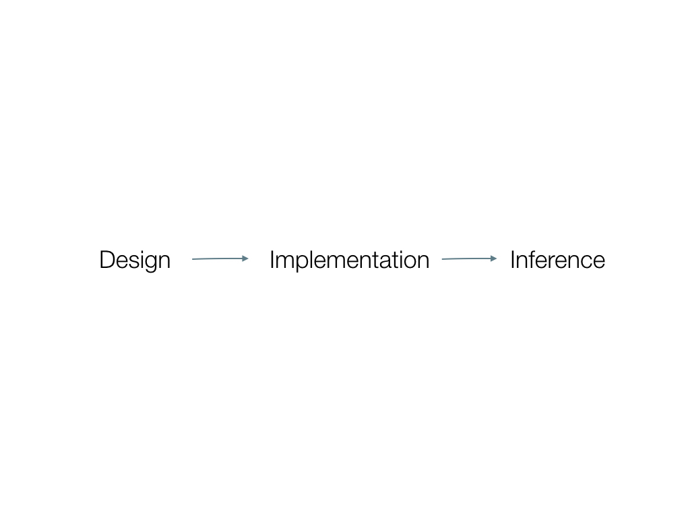
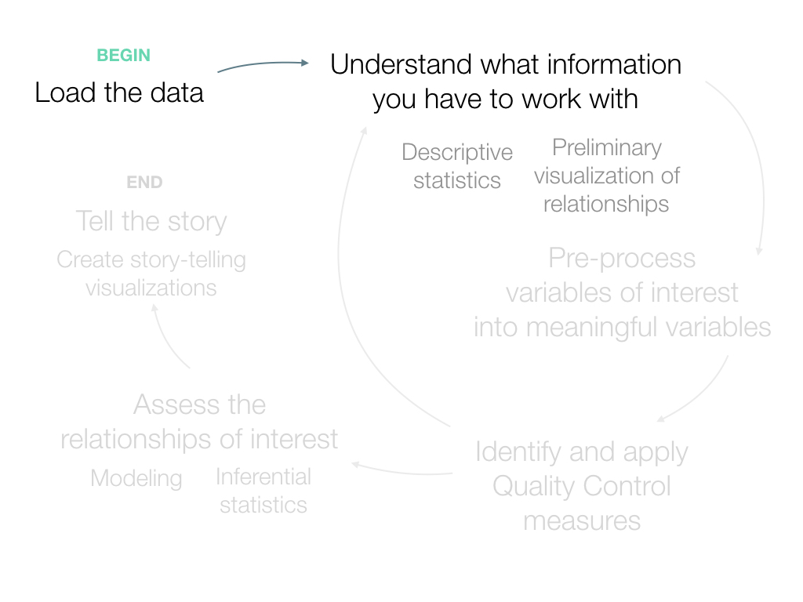
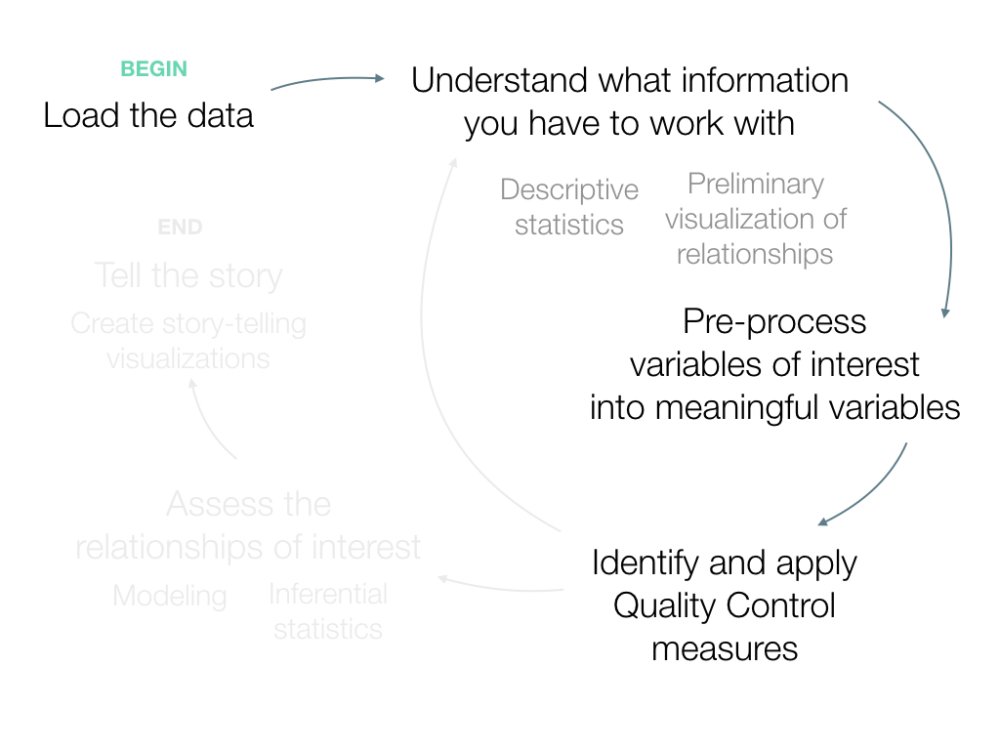
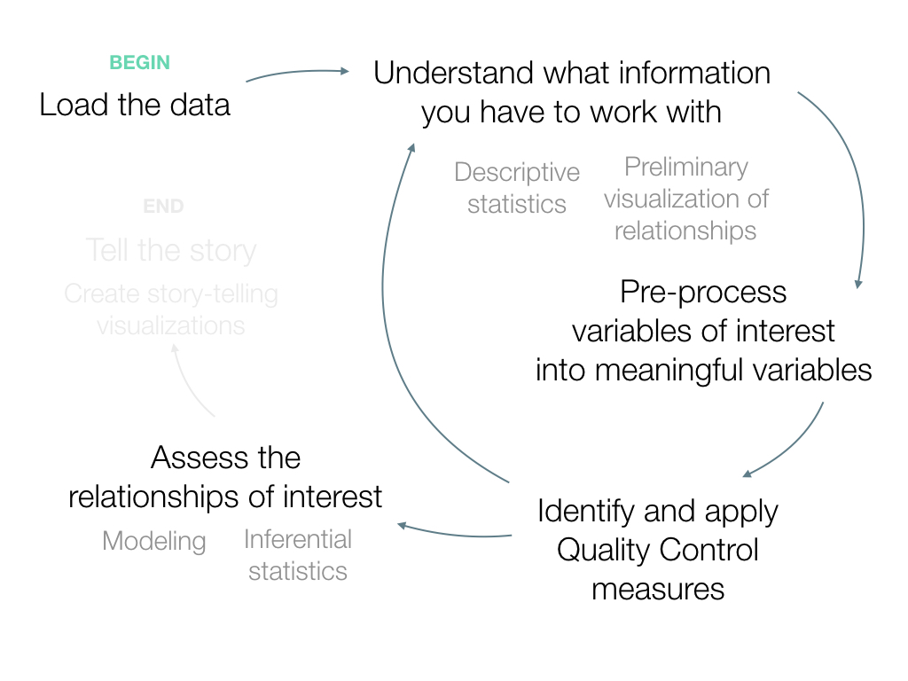
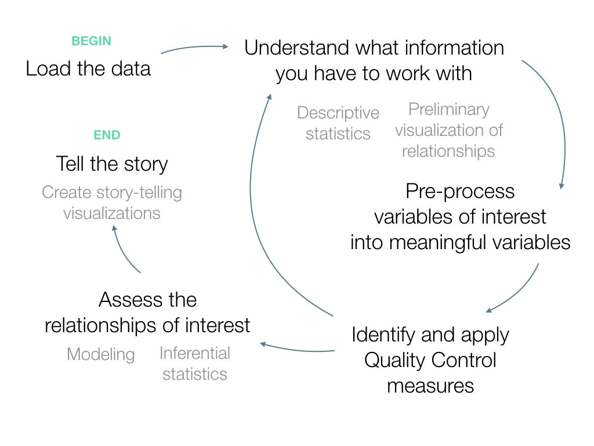

###  How to build a data analysis pipeline 

 
Athena Hadjixenofontos, PhD
 
Director of Engagement
 
Center for Computational Science
  
ahadjixenofontos@miami.edu
 

---

@title[1. Gentoo penguins]

Note:
Prepare video here, starting at minute 2:00. Okay to have sound on, as long as it starts at minute 2:00. 
http://channel.nationalgeographic.com/wild/videos/chick-chase/

We're about to watch a video of gentoo penguins. The penguin in the front is a parent, and the penguin in the back is the chick. 

What do you think they’re doing? Write a phrase or a sentence to describe what they're doing on your notepad

Who wants to share? 

Those are colored by your experience of the world. YOUR experience
If you’re a mom and had a rough morning with the kid you may see it as the mom is running away. 
If you are a student you may see it as the chick playing with its parent and at the same time learning how to get away from predators by mimicking its mom.
If you are an evolutionary biologist you may see it as the mom making sure that only the fittest offspring get fed. 
All you actually see is penguins running.

Anthropomorphism is one example of seeing things not as they are, but as we are. 

---

@title[2. Anais Nin]

We don't see things as they are,   
we see them as we are. 
   - Anais Nin 

Note:
The main point we will explore today is how who you are shows up in the various stages of a data analysis, from design to inference. 

---

@title[Empiricists]

... it is impossible for us to **think**   of any thing, which we have not antecedently **felt**, either by our external or intenal senses. 
   - David Hume 

Note:
What we are really asking is "what can I know"? Can I know that the mother is tired of the chick constantly bugging her? Can I know that the mother is trying to determine which chick is hungriest? If we are willing to connect your interpretations of observations to knowledge that you are gathering about how the world works, we need to  acknowledge the philosophers who have laid down the foundation that seeps into our treatment of this subject. 

Epistemology is the field of philosophy that asks what I think are some of the most difficult and most fascinating questions. There are a few main schools of thought: the empiricists who insist that the ultimate source of all knowledge is observation. Hume was one of them, claiming that the knowledge cannot be gained based on something innate, but that is forms a posteriori, based on your set of experiences. 

---

@title[Rationalists]

Vulcanians don't speculate, I speak from pure logic. If I let go of a hammer on a planet that has positive gravity, I need not see it fall to know that it has in fact fallen. 
   - Mr. Spock 

Note:
The rationalists, on the other camp, if you subscribe to such camp divisions, insist that some knowledge is accessible by intuition alone, and other knowledge can be deduced from intuition, using the rules of logic. 

Spock here expresses an idea that originated with Plato and Pythagoras, that there is an objective reality that can be accessed through logic. 
The position that you choose to take has implications for your decisions in all stages of data analysis. I am not so much concerned with the truth of who is right, but more concerned with which of these positions serves us best when we work with data. That's the first take away. 

---

@title[Popper]

Note:
I personally don't view intellectual intuition as something innate, but rather as something that is developed through observation. Scientists, being human beings, cannot escape the biases introduced by the very specific way in which humans perceive the world, process information and reach conclusions. 

As we saw with the penguins, having a sharpened intuition by repeated contact with a topic, like the evolutionary biologist, may help us get closer to the truth, if such a thing exists. As soon as you switch environments, or perhaps type of data, the intuition needs to be built up again. Perhaps 

There are lots of layers to the philosophical debate, which I'm not qualified to take apart, so we'll leave this discussion here, the second take away being that the foundations of data science, as a science, have a long and rich history in multiple fields, which is often overlooked because the term "data science" itself is so new. 

---

@title[4. Why is this important?]

Note:
I do not intend for this to be just another talk on how biased algorithms are cheating you of a good credit score or on avoiding blind faith in data, which of course we should do. 

But I think the context is important. The popularity of a field which we now call data science has sky rocketed. "Data scientist is the sexiest job of the 21st century" which has some positive and some negative consequences. 

The positive consequences is that data is accessible to absolutely anybody, lots of open data, lots of online courses to learn programming, one of the most basic tools of data analysis. Lots of open source libraries have been developed that implement algorithms that used to be inaccessible. This is great! The data revolution is upon us. 

Whether or not you can answer specific questions you care about with the quality and type of data that is available is a separate question. 

On the flip side, the fact that data and ways to analyze it is open to absolutely anybody also means that we now have a responsibility to at least try to convey not only what kind of code you need to write to analyze data, but also more abstract but very, very important concepts,

I think that I'm observing a tendency of placing a lot of emphasis on the tools: "you need to learn python, you need to learn how to use specific libraries such as tensorflow, numpy, nltk, and scikit-learn". I think that this emphasis on the tools ends up giving people the false sense of security in their data analyses, while key concepts that have to do with the science part of data science remain in the dark.  

---

@title[5. Lots of ways to learn about tools]

### Science is not only about the tools. 

Note:
It seems unreal that I even feel the need to make this statement, but after thinking about it for a while I think that emphasis on tools can be justified. Learning how to use a tool is something that you can something you can teach yourself through a MOOC, or through participating in Kaggle competitions. Whereas learning how to problem solve like a scientist, meaning questioning every step that you take and every number that you come up with, is perhaps more difficult to learn online. 

As Director of Engagement for CCS, I meet a lot of people, most of whom are in some way related to data science. The only ones I've seen who have both the tools and the science are those who've gone through a PhD, or worked in the R&D department of a company. Either way, we are talking about researchers, not hackers and not software engineers. 

---

@title[6. Learn from the pros]

Note:
So who are these people? Who are data scientists, and can we study them to help us keep the science in data science?

There is a myriad definitions of data science. This one is my definition. It highlights the interdisciplinarity of data science. The field changes depending on the data that you have. 

I'm not talking about analysts here, there's a big difference between the question "how many dolls did we sell this quarter?" and ""

+++

@title[7. What is data science?]

+++

@title[8. Who am I?]

Note:
Of course, this view is most definitely biased by my training in both graduate school and postdoctoral positions, as a computational geneticist. This is who I am, my version of data science is at the intersection of statistics, computer science, and genetics. So take it with a grain of salt. 

---

@title[Stages of data analysis 1]

Note:
For the rest of the talk, we will examine the stages of data analysis, and what it really means to proceed through them as a data scientist. Broadly speaking, these are analogous to any other project, so what I'd like to highlight as we go through are the opportunities 

A big part of keeping the science in data science, is being aware of your biases, your assumptions, the ways in which you've shaped the questions you are asking based on your collection of previous thoughts and experiences, and based on your five human senses and your human reasoning. 

This comes in very early on while you are still designing the way you'd like to answer a question. 

+++

@title[Stages of data analysis 1]

+++

@title[Stages of data analysis 1]

+++

@title[Stages of data analysis 1]

+++

@title[Stages of data analysis 1]

---

@title[Problem definition]

Are you asking the right question?

Note:
One of the major decisions to make in the design phase is defining the question that you'd like to ask, while taking into account the information that is available. 
I'll use one of the projects that a PhD student from Modern Languages and Literatures, Elena Bonmati, is currently working on. I'll take you through the thought process, which may be a little embarassing because I will be exposing what can be perceived of as mistakes in our thought process, but I think illustrative because if we are to benefit from those mistakes the least we could do is learn from them.

This question: are you asking the right question, is a cheeky one, because to answer it you need to define "right". 

+++

@title[Catalyzing collaborations]

In a University with 3,129 faculty members, and 911 additional staff researchers, can we identify pairs or teams to work on collaborative research projects? 

Note:
So here is what we were interested in answering. There's quite a bit of literature by now that suggests that one of the components of innovation is interdisciplinarity. If that's true, this sounds like a nice question right? One that many people would like to know the answer to. There are some things in there that are vague, such as what data can we use to answer this question, and what is an appropriate range of disciplines to consider: should pairings between music researchers and a political scientists be identified, or only more conventional pairings that may be more likely to work out, such as marine scientists and computer scientists? Wait a minute, to answer that question we need some kind of measure of the relationships between disciplines! Not all pairings are going to make sense together, particularly in the absence of a problem to which the disciplines will apply themselves. 

I find it useful to actually get my hands on some data that may, at a first glance, be suitable for answering this question. I know that I am incredibly lucky to be able to do this at no real cost, thank you data revolution. In this case, we decided that we would use text from faculty publications that we could access through databases, use that text to infer the researcher's areas of expertise with text clustering and topic modeling, then create network diagrams that may help us visualize existing relationships between researchers from different disciplines. 

At 

Catalyze collaborations was a problem that was stated through my CCS glasses
Once we saw things through other people’s eyes (faculty who don’t want to be told to collaborate and other admins) the problem was reframed completely and became diffferent than what we originally thought it was
Now it is "how does the organizational structure of the university reflect the work that is being done in practice" which is a reflection of me feeling like I don't belong in any one discipline 
This is something about me that is taking flesh as a project

---

@title[Abstract to concrete]

Translating the abstract to concrete involves a series of decisions. 
 Those decisions are, to a certain extent, arbitrary. 

Note:
Once your question has been translated to the concrete, does it still reflect the general idea behind the abstract question? Often times the answer to that is no and you need to be able to evaluate both the probability that the answer to that is no, and how it impacts the inference that you can make.

---

Perhaps this is just the way science goes.

Note:
Were those initial decisions mistakes? Is it possible to have gotten to the point we got to without having gone through the process that got us here? I don't know. This is a larger question that touches on the idea that science is "self-correcting", because this process of refinement doesn't only happen within a study, but between studies. After all, where we break up a project into a publishable piece is also an arbitrary decision. This idea that science is self-correcting invokes commentary on the public perception that scientific studies produce contradictory results, so how do you know what to trust? One study shows that a compound is carcinogenic, the next study shows that it's harmless - as a consumer, what do you believe? Diet studies are notorious, but this phenomenon is not exclusive to them. 

The question "what can I trust?" makes sense in the context of "there is one correct answer that you should be able to find out through one study", because it assumes that there IS something to trust, which is a very elementary view of how science works. In reality, the "answer" that you get is at best only applicable to a very specific set of circumstances, and varying levels of confidence. Data is messy. Working with it requires being comfortable with not knowing things, which is not a space that is comfortable for many people. Perhaps it's okay that it's messy. 

---

Controls are essential to make sense of your observation
How tall is tall? 
Is there really a difference between two groups?
All else needs to be held constant. 
The things that you think of, the variables you choose to collect data on 
may depend on your point of view. 
Someone else, with a different set of biases may select a different set instead. 

For ML approaches you may be tempted to say 
"well, this doesn't apply, because it's the algorithm that chooses relevant features, not a human"
Howeevr, the human still determines what is available for the algorithm to learn from, which is how we are ending up with racist AI

We have all heard of the example of google gorrilla
We are making the AI in our image

On controls
Can you find more positive sentiments on good weather days vs bad weather days? 
Compare books by country based on their average days of subshine per year
Or a non-fiction or fiction books which were written throughout a year, if we have the info on when the authors started writing and make assumptions about how many words they wrote per day

---

What are the threats to the validity of your results? 

---

> Beware of bugs in the above code; I have only proved it correct, not tried it.
> Donald Knuth

Note:
These are the words of Donald Knuth, author of The art of computer programming, a legendary book from 1968, communicating the difference between math and buggy reality. 

What gets lost when you abstract away the messy, physical world? You need to be aware. 

The fact that programming languages are much less ambiguous than natural languages makes it even more critical that we code with a conscious awareness of the biases that our code could introduce. 

---

@title[CCS Data Scholars]

Note:
I am very excited that what we've come to call data science is so popular. I am not alone in thinking that this "trend" won't go away. For that reason, last summer we hosted 18 girls through a partnership with a local non-profit organization called Educate Tomorrow, which works with foster care and similarly disadvantaged youth 
We created a program for them to at the very least expose students to the various facets of data science early on, and at most, hopefully, inspire them to incorporate a data-mindset in the way they view the world around them, and to incorporate programming in their toolset. 

---

@title[Projects across disciplines]

Note:
A key feature of this program is to showcase how data science can be married to almost any other discipline. If you're into literature, as this audience knows all too well, you can open up a whole world of questions that you can ask by picking up the tools. Same if you are into questions that have to do with "where" as represented by spatial data, or images. 

---

@title[Image project]

In our image processing project, the main question we were asking was whether it's better to smile or not to smile in the selfies that you post to social media. 

---

Rorshack test in psychology
You see what you are

In the expanse episode of the imaginary worlds

---

Note:
Maps reflecting the points of view of the people making them
Exercise in selection
Omitting and emphasizing certain details
Your decisions are responsive to your motives for making the map

Cuban exile community’s map highlighting conflicts

Map from the Castro government highlighting assassination of school teachers

Instead of representing reality they are proposing a reality

The agendas of the agents are being played out

Rob
Kichin

The Data Revolution: Big Data, Open Data, Data Infrastructures and Their Consequences

Assumption of sea faring

---

“A lot can depend on little things.” Daniel Messinger on the idea of relying on neural networks to understand and combat the replication crisis in psychology

---

@title[Rabbit hole paths]

Note:
Visualizing the rabbit hole which is actually an ant colony
The route you take through the colony depends on what drew you which is affected by your biases
You create a route based on who you are rather than what it actually is

Stephanie Yahn credited with idea

---

Datum is latin for given, but when you are working with data, there's nothing that's given
It's all in the eye of the beholder

Tim Norris 

